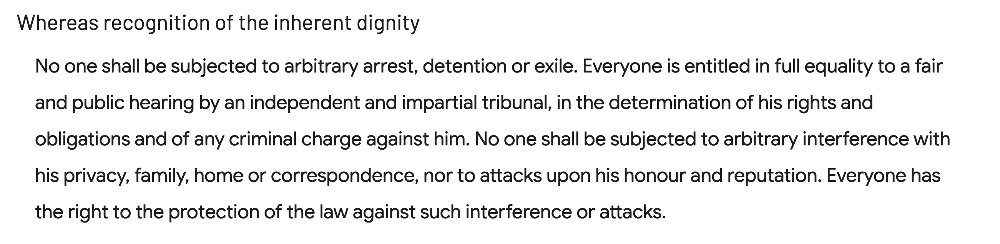
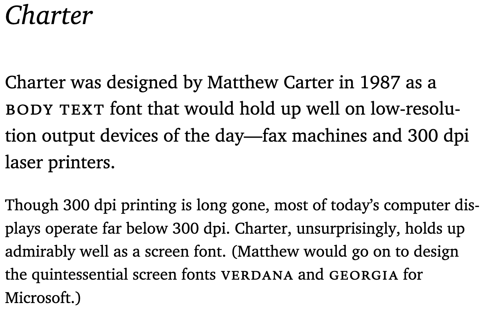
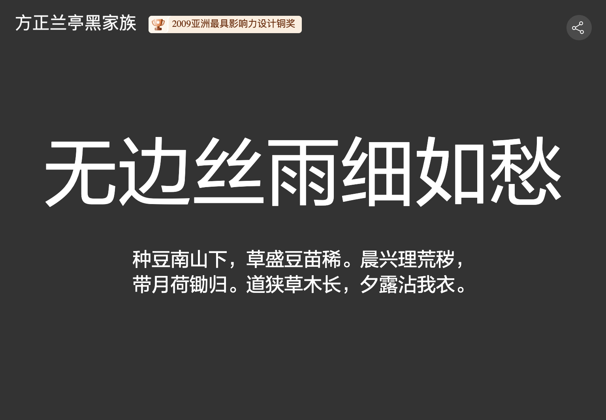
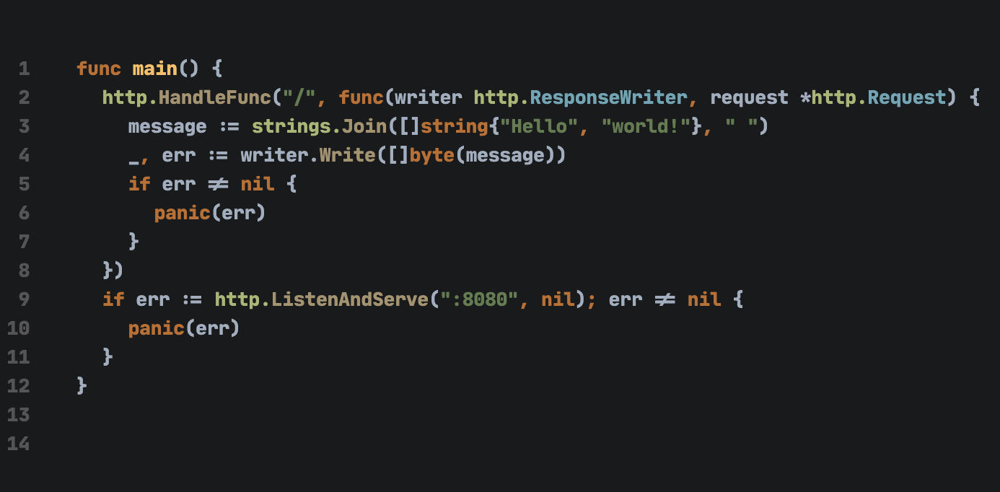

This is a memo to keep track of the fonts I use in different contexts.

# 📖 Reading

## English

### 🔤 Barlow

Barlow is a low-contrast, slightly rounded, sans-serif typeface inspired by the visual language of California's public signage. Designed by Jeremy Tribby, Barlow carries a sense of approachability and modernity, making it ideal for both digital interfaces and print media. Its clean, open forms promote clarity and readability, while its extensive range of weights provides versatility across various design projects.

- 🔗 [Barlow - Google Fonts](https://fonts.google.com/)
- 📝 [SIL Open Font License, 1.1](./LICENSE-Barlow)

### 🔤 Charter

Charter, designed by Matthew Carter in the late 1980s, is a transitional serif typeface that emphasizes strong legibility even at small sizes or under challenging print conditions. Charter was engineered with the constraints of early digital typesetting in mind, making it highly efficient and sharp on screen and in print. Its sturdy, balanced letterforms convey a sense of tradition with a modern edge, making it a favorite for editorial work and long-form reading.

- 🔗 [Charter - Font Family › Fontesk](https://fontesk.com/charter-typeface/)
- 🔗 [Charter - Butterick’s Practical Typography](https://practicaltypography.com/charter.html)
- 📝 [Charter License](./LICENSE-Charter)

## Chinese:

### 🔤 方正兰亭黑体(Lantinghei)

Lantinghei is a modern Chinese typeface that combines traditional elegance with contemporary simplicity. Widely used in Chinese user interfaces and branding, Lantinghei balances the complex structures of Chinese characters with a clean, harmonious aesthetic. It offers a smooth reading experience, whether in body text or headlines, and is often praised for its humanistic touch and versatile design.

- 🔗 [方正兰亭黑体](https://www.foundertype.com/index.php/FontInfo/index/id/216)
- 🔗 [方正兰亭黑体 - 数英](https://www.digitaling.com/articles/17129.html)
- 📝 [个人非商业授权](./LICENSE-Lantinghei)

# 👨‍💻 Coding

### 🔤 JetBrains Mono

JetBrains Mono is a typeface specifically crafted for coding environments. Developed by JetBrains, this monospaced font focuses on readability and developer ergonomics. With generous line spacing, clear character distinction, and subtle, friendly shapes, JetBrains Mono helps reduce eye strain during long coding sessions.

- 🔗 [JetBrains Mono - Google Fonts](https://fonts.google.com/)
- 🔗 [JetBrains Mono - A free and open source typeface for developers](https://www.jetbrains.com/lp/mono/)
- 📝 [SIL Open Font License, 1.1](./LICENSE-JetBrains-Mono)

# 📑 References

- 🔗 [What fonts are used by Medium - Quora](https://www.quora.com/What-fonts-are-used-by-Medium)

